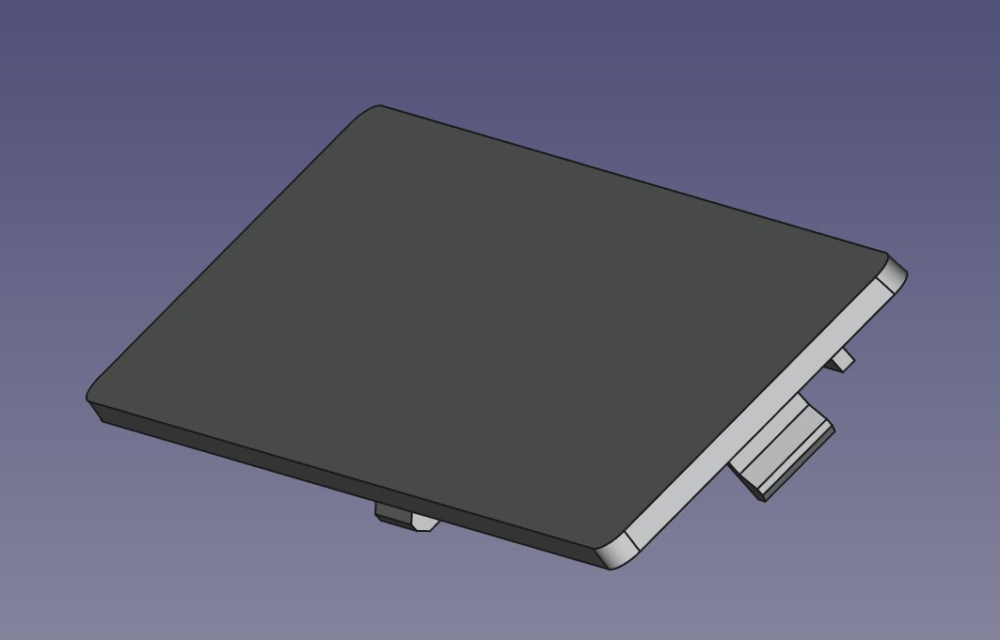

20250815 - Initial Reference Model
Not FDM Printable (tabs break)
Known Slight differences:
1.) Slightly too thick
2.) Draft angle needs to be slightly more

TODO: Make a second Body in the model that is intended for 3D printing on textured sheet, TABS a little thicker (3 layers), taller, and "modular"

Special Thanks: Doctor Octal (http://DoctorOctal.com/) of the Brutman PCjr forum graciously sent me an original blanking plate which enabled me to take measurements and create this model. Thank you!!
